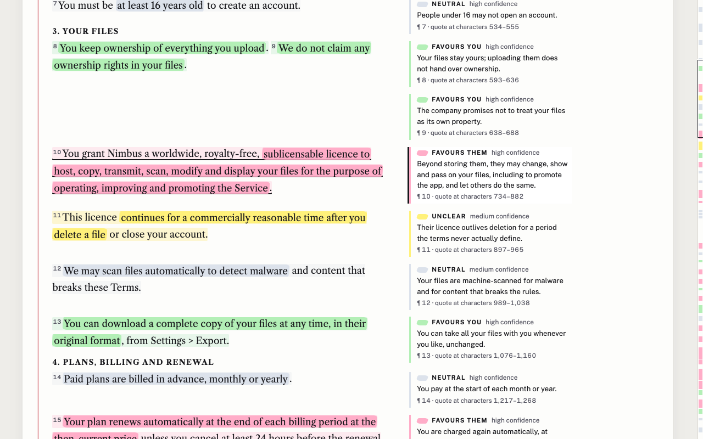

# small print

Paste a Terms of Service; get a clause-by-clause map of who each clause favours, with the exact quote.



## The 30-second experience

1. Paste a Terms of Service (plain text, or HTML source) into the page, or open one of three fictional **exhibits**.
2. The document comes back as one long strip, each clause washed in a highlighter colour: **favours you** (green), **favours them** (pink), **neutral** (blue-grey), **unclear** (yellow).
3. Inside each clause, the exact words that justify the label are marked like a highlighter on a printout. Beside the clause, in the margin: a one-line plain-English reading, a confidence label, and the quote's character offsets in the text.
4. A thin strip down the right edge of the page maps the whole document by colour; click it to jump. `j` / `k` move clause to clause.

Nothing is summarised without its source clause on screen, and every quote is checked. The Worker looks for each quote in your text, character for character (a plain substring check, no fuzzy matching). Any reading whose quote is not there is dropped, and the page says how many were dropped and why.

**This is not legal advice.** It is a reading aid; the page says so above every result.

## Why Python

The core of the job is text work: normalising pasted text, splitting it into clauses without breaking on "e.g.", "Inc." or "Section 4.2", and checking model quotes against the source. Python is good at that, and Cloudflare now runs Python Workers (Pyodide on workerd). The Python here does real work:

- `src/small_print/normalise.py`: canonical text and the SHA-256 cache key.
- `src/small_print/segment.py`: the clause segmenter. It handles headings, abbreviations, list numbers, inline "(a) … ; (b) …" lists, and short and very long sentences.
- `src/small_print/verify.py`: quote verification. It uses exact substring checks, relocates a quote that sits in a different clause than the model named, and counts every drop with a reason.
- `src/small_print/budget.py`: the daily budget ledger (SQL shared by the Durable Object and the tests).
- `src/small_print/service.py`: the HTTP handlers, independent of the runtime.
- `src/small_print/model.py` and `prompt.py`: the model call through the official `anthropic` SDK.

`src/entry.py` is thin glue to the Workers runtime.

The official Anthropic Python SDK runs unmodified inside the Worker. Cloudflare's Pyodide build ships `httpx2_jsfetch`, which routes the SDK's HTTP client through the Workers `fetch`. This was checked in `wrangler dev`, where the SDK's real request went to a local mock server. So there is no hand-rolled HTTP client.

## How it works

```
browser                                    Python Worker (/api/*)                  model
-------                                    ----------------------                  -----
paste -> strip HTML (DOMParser, inert)
      -> split into parts <= 10,000 chars
      -> POST /api/analyze  (one per part) -> validate, cap 60,000 chars
                                           -> normalise, SHA-256
                                           -> segment into clauses (Python)
                                           -> D1 cache hit? return it (free)
                                           -> Durable Object: take 1 from
                                              today's budget (atomic)
                                           -> Claude Opus 5.5, effort "medium",  -> JSON: id, quote,
                                              structured output (JSON schema)        favours, reading,
                                           -> verify every quote verbatim           confidence
                                           -> cache offsets + readings in D1
render strip, highlights, margin notes  <- text, clauses, verified readings
```

The browser strips HTML and splits long documents into parts, which keeps the Worker's CPU work small. While the model thinks, the Worker is only waiting on I/O.

**The model request** (`src/small_print/prompt.py`) follows the Claude Opus 5.5 rules:

- model `claude-opus-5-5`, with `output_config.effort` set explicitly to `"medium"`;
- thinking is never disabled and no `budget_tokens` is sent (adaptive thinking, the model's default);
- no forced `tool_choice`: the clause list comes from structured outputs (`output_config.format` with a strict JSON schema);
- a cached system prompt that tells the model to treat the document as data, not instructions;
- server-side refusal fallbacks (`fallbacks: "default"`, beta `server-side-fallback-2026-07-01`). Set `ANTHROPIC_FALLBACKS = "off"` to disable them.

**Demo mode.** With no `ANTHROPIC_API_KEY` secret set, the app runs in demo mode:

- pasted text still gets the real clause map (segmented in Python), without readings;
- cached analyses still open;
- the three exhibits are fully read.

The exhibits are fictional companies (Nimbus Locker, Pacewren, Brothbike) with terms written for this repo. Their readings (128 of them) were written by hand in the exact JSON shape the model returns, and at build time they pass through the same Python verifier (`scripts/build.py` fails if any quote does not verify). They also work from a static host with no Worker at all.

## Build, run and test

Toolchain: Node 20+ (for wrangler and the page tests) and [uv](https://docs.astral.sh/uv/) (it fetches Python and the Pyodide toolchain). Chrome or Chromium is needed for the browser tests; they skip cleanly without it (`CHROME_PATH` points at a specific binary).

```sh
npm install           # wrangler, pinned
npm run build         # -> dist/ (static UI + precomputed exhibits), via scripts/build.py
npm test              # pytest (124 tests) + build + node --test (18 tests, incl. headless Chrome)
npm run test:e2e      # the real Worker in local workerd, demo mode and a mocked model
npm run dev           # build, apply D1 migrations locally, pywrangler dev on :8787 (demo mode)
```

`npm run test:e2e` starts `pywrangler dev` twice.

- **Demo mode (no key):** it checks the clause map without readings, the exhibits, `j`/`k`, pasting HTML (it must never execute) and bad input. The browser checks run at 1280 px and at a true 400 px (DevTools device emulation), with no horizontal scroll and no console errors.
- **Live mode against a local mock of the Messages API:** the SDK inside the Worker sends its real request to `127.0.0.1`. The test checks:
  - the request shape: model, effort, schema, fallbacks and headers;
  - that the mock's one deliberately wrong quote is dropped and reported;
  - that the D1 cache serves repeats with no model call;
  - that the Durable Object budget stops at the limit while cached documents still open;
  - that the Worker's logs contain neither the key nor document text.

No test ever calls the real API.

## Running on Cloudflare's free plan

| Piece | What it uses | Free-plan limit |
| --- | --- | --- |
| UI (`dist/`) | Static assets on Pages, or the Worker's assets binding. Requests outside `/api/*` never wake the Worker. | Unlimited static requests |
| Worker | One request per document part (up to 10,000 characters), plus one status check per page view | 100,000 requests/day; 10 ms CPU per request |
| Durable Object `BudgetCounter` | One call per API request; about 2 rows written per model call | SQLite-backed only on Free: 100,000 requests/day, 100,000 rows written/day |
| D1 `small-print-cache` | 1 row read per analysis request, 1 row written per new analysis | 5M rows read, 100,000 rows written per day |

**CPU.** Most of a request's wall time is waiting for the model, which is I/O and does not count as CPU. The Python work per part was measured on CPython on the build machine: normalising and segmenting a 58,000-character document took about 2 ms and 1.5 ms, and verifying 46 readings took under 0.1 ms. Pyodide in the Worker is slower than native CPython. CPU time in production has **not** been measured (it needs a deployed Worker), so the 10 ms limit is expected to hold for 10,000-character parts but is not proven.

**The AI budget.** `DAILY_BUDGET` (default 40) caps model calls per UTC day across all visitors, and `PER_VISITOR_DAILY` (default 8) caps them per visitor. The counter lives in one SQLite-backed Durable Object, so increments are atomic. A failed call that was never billed is refunded to the budget. The visitor key is an HMAC of the IP under a random salt that is created each day and deleted with that day's rows. When the budget is spent, the page says so and offers cached documents and the exhibits.

A rough, unmeasured estimate for the owner: one call with about 2,500 input tokens and about 6,000 output tokens (thinking included) at $4 / $20 per million tokens is roughly $0.13, so the default 40 calls a day comes to around $5 a day at most. Real token counts will differ.

## Deploying (owner only)

Deploy-ready, not deployed. The owner deploys only through the guarded script `scripts/deploy.sh`. It calls `~/RamenProtocol/_ops/infra/ramen-deploy.sh`, which refuses to run unless the Ramen Cloudflare account is configured, so the machine's global wrangler login is never used. One-time setup, run under that same account:

1. `wrangler d1 create small-print-cache`, then put the printed id in `wrangler.toml` (`database_id`).
2. `wrangler d1 migrations apply small-print-cache --remote`
3. `wrangler secret put ANTHROPIC_API_KEY` (skip this to stay in demo mode).
4. `scripts/deploy.sh worker`. This deploys the API and serves the UI from the same origin.
5. Optional: `scripts/deploy.sh pages` puts the UI on Pages. Build it with `SMALL_PRINT_API_ORIGIN=https://<worker host>` so the page (and its CSP `connect-src`) points at the Worker, and list the Pages origin in the Worker's `ALLOWED_ORIGINS`.

For readers deploying their own copy, the plain equivalents are `uv run pywrangler deploy` and `npx wrangler pages deploy dist --project-name small-print`. Note that the owner of this repo deploys through the guarded script instead.

## Privacy and safety

- Document text and API keys are never logged. The Worker logs one line per analysis with counts only, and a test checks this.
- The cache is content-addressed. It stores offsets, labels and readings, never the text. A row can be found only by someone who already has the exact text, and there is no listing endpoint.
- Pasted HTML is parsed in an inert `DOMParser` document: scripts never run and resources never load. All rendering uses text nodes, never `innerHTML`.
- A strict CSP (`script-src 'self'`, no inline script or style) and no third-party scripts. Fonts come from Google Fonts.
- The theme choice and your last five read documents are kept in this browser's `localStorage` only, and the page works without them.

## Honest limitations

- The labels are one model's reading of legal text, at medium effort. They can be wrong. The verifier proves only that a quote is in the text, not that the label is right.
- Segmentation is heuristic. Unusual formatting (tables, one giant paragraph, hard-wrapped PDF text that starts lines with capitals) can produce odd clause boundaries. Every character of the text is still shown.
- Quotes must match exactly. A model that normalises a curly quote or a double space loses that reading; it is dropped and counted, not guessed at.
- Wide screens open up space in the text so that each margin note sits level with its clause. Documents with many short clauses on one line get tall gaps.
- The CPU cost in production and the model's real latency and token use are unmeasured, because no paid calls were made while building this.
- The document limit is 60,000 characters. Longer documents need to be pasted a section at a time.

## Next

- **Bring your own key**: an explicit toggle that sends a visitor's own key to the Worker for one request, never stored or logged. It was deferred to keep the security surface small.
- **URL fetch**: paste a link instead of text, with safeguards against SSRF and oversized pages.
- **Workers AI fallback** when the daily budget is spent.
- Measure CPU time and token use on a deployed Worker, then tune the part size and `max_tokens`.
- Cache expiry, and a "compare two versions of the same terms" view.

## Credits

Built by Ramen Protocol ([ramenprotokol](https://github.com/ramenprotokol)) with AI assistance from Claude. The exhibits are fictional, and no real company's terms are quoted anywhere in this repository. Licensed MIT.
